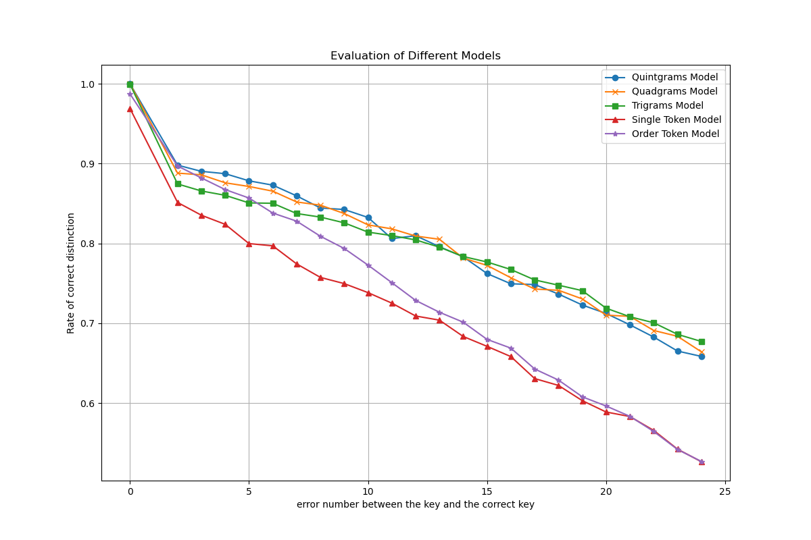
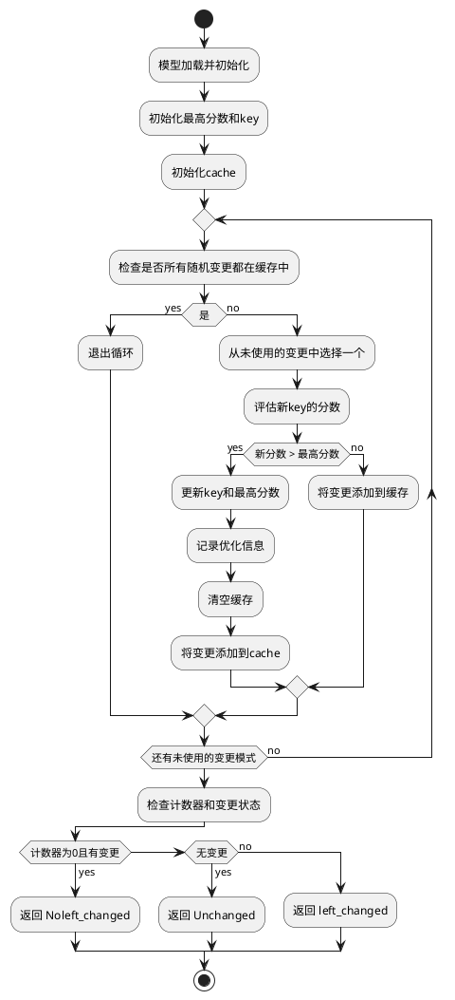

# 项目概览
基于爬坡算法，运用各种模型（n-gram,tokenizer）还原单表代换加密的解密项目。大部分内容是框架性设计，使用者可以轻松扩展与diy。
# 主要项目结构
## exe
项目的可执行文件与相关环境，有完整文件夹即可运行
## gui
项目的用户界面板块
## evaluate
评估模块
### database\.py
用于与data.db交互，用于增加数据库内文本，同时提供数据库的抽象接口供evaluate_all与evaluate_some使用
### evaluate_all
解密能力测试：对随机文本随机加密后进行解密统计还原成功的比率与运行时间。该项目中对于50词左右的文本恢复率达72.5%，平均用时1.15s。 

 __注__:这只是统计结果，对于特定文本可能效果存在浮动，辅助以人工判断多运行几次恢复率将显著提升
### evaluate_some
模型分辨能力测试：
- 定义:
   - 标准排序```UNIT_VECTOR```为```（a,b,c,…,z）```
   - 置换```f=（a1,b1,…,z1）```,代表```f(a)=a1,f(b)=b1,…,f(z)=z1```
- 实现：
   - 生成一个与标准排序汉明距离为```i```的置换```f1```，再生成一个与```f1```汉明距离为```2```与标准排序距离大于```i```的置换```f2```(其中i=0,2,…,24)，这样```（f1,f2）```我们成为 __i-组__
   - 取明文```text```，```f1```置换后得到```text1```，```f2```置换后得到```text2```。 用对```text1```与```text2```进行评分，对大量 __i-组__ 统计评分结果的大小关系与```d(text,text1)```和```d（text,text2）```的大小关系一致的比率。

该项目实现的部分模型效果图
# decrypt_core
## decrypt_main
简化解密流程如下：

__注__ 同时还有些设计细节没有展现比如:
- 实际实现可以加入各模型迭代次数或总次数的限制
- 每个模型分析的密文区间是可以自设计的
- 有cache机制对于执行到极值的模型不会被连续执行
```PlantUML
@startuml
start

:模型加载并初始化;
:依次执行model_order_list中的模型;
if (评估器分析是否达到预期结果?) then (yes)
  :结束;
else (no)
  :随机执行model_random_set中的模型;
  while (评估器分析未达到预期结果?) is (no)
    :随机执行model_random_set中的模型;
  endwhile
  :结束;
endif

stop
@enduml

```
## score
评分器模块
## log
解密日志存放区
## f_model
模型模块
## model_register
模型注册器，实现的模型经过注册后供上一层抽象使用
### model_interface
```class Model```所有模型需要遵循的的接口,至少需要实现：
- init_key:密钥如何初始化（提供了一个基于单字符频率的初始化的默认选择的抽象方法）
- decrypt:本项目提供了Random_Mixin与Order_Mixin的混杂类，通过继承其中之一可以实现该抽象方法
- core_func:在已经知道密文的情况下，模型如何对评估的密钥进行打分，没有提供默认实现

Random_Mixin其策略如下

Order_Mixin实现类似：主要区别在于该方法并不是在变更后立即对估计密钥是否更改做出判断，而是26个共有同一个位置的更改集合中选出最佳的再对密钥进行更改。
## token_model
一个以分词器为核心的文本有效性打分模型
## n_grams_model
以n元组词频统计为核心的文本有效性打分模型
## shuffle_model
一个简单的随机置乱模型
# 参考网站
n_grams模型的主要算法参考
http://practicalcryptography.com/cryptanalysis/text-characterisation/
# 环境配置
仅在python3.10与python3.12下测试过以及可能需要根据指示下载一些关于t5-base的依赖项